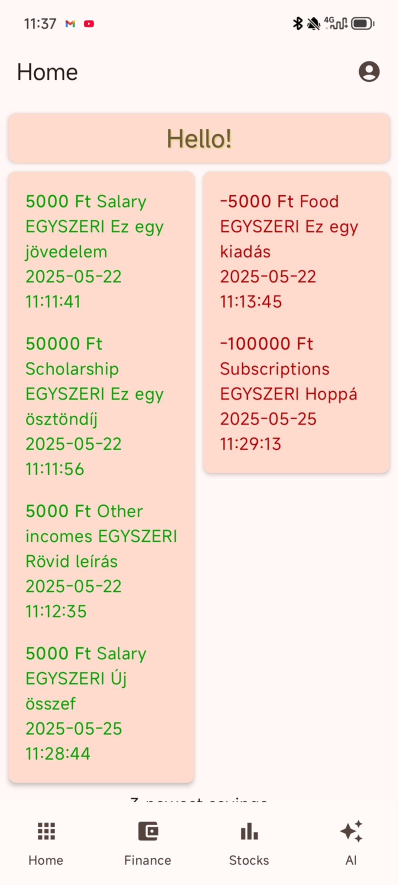
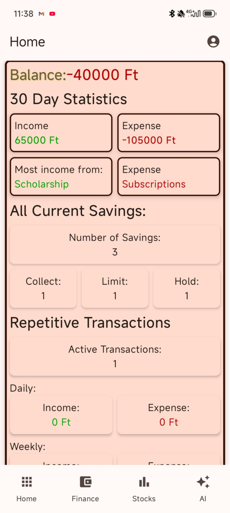
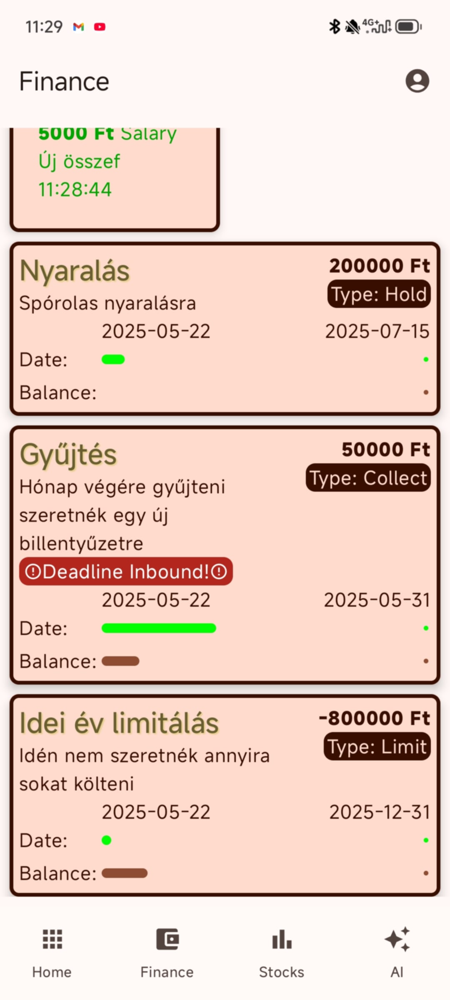
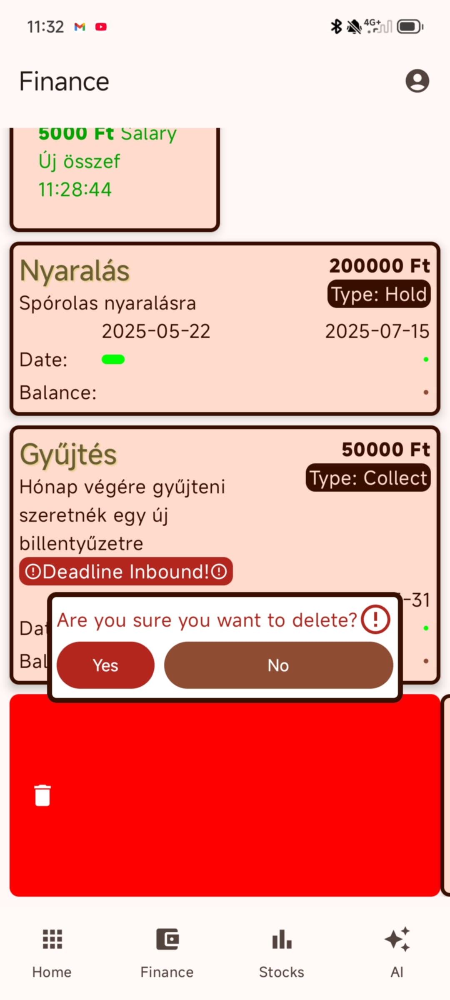
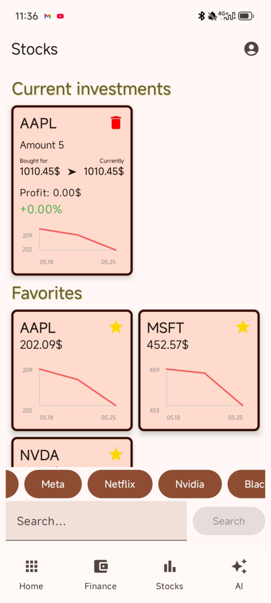
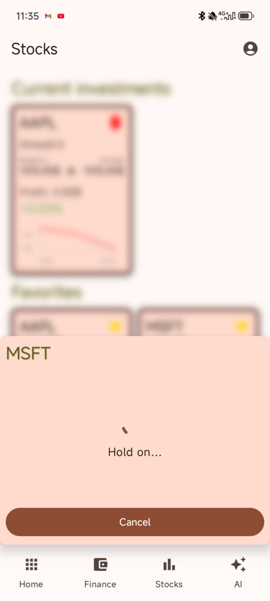
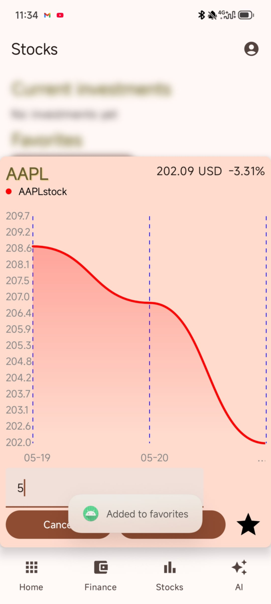

# Házi feladat specifikáció

Információk [itt](https://viauav21.github.io/laborok/hf)

## Androidalapú szoftverfejlesztés
### 2025.04.13
### Szabó Norbert (T0DZ5U) - Balogh György (NQO2EW) - Sarkadi Dávid (DA0U7O)
### pufac03@gmail.com - jetuburger@gmail.com - sardavid4@gmail.com 
### Laborvezető: Gazdi László

## Bemutatás

Ez egy diákok számára pénzügyi segítő alkalmazás, amelyben rendszerezni lehet a bevételeket, és a kiadásokat. Alapszintű piac figyelő, és AI tanácsadó is be van építve.

Miután jelentkeztünk, ötleteltünk, végül erre esett a választásunk. Úgy terveztük, hogy ez az alkalmazás megfelel a versenyre is, és NHF-nek is egyaránt.
A célközönség leginkább a pénztudatosságra törekedő fiatalok, és kezdő befektetők.

## Főbb funkciók

- Bevételek és kiadások rendszerezett vezetése
- Rendszeres kiadások illetve bevételek kezelése
- Ezek statisztikai és grafikus megjelenítése
- Megtakarítási célok kitűzése, hogy mit szeretnénk elérni
- AI tanácsadó, amitől tanácsokat lehet kérni, a pénztudatosság érdekében.
- Részvények böngészése, megjelölése követésre, részvénycégek kedvencekbe kategorizálása
- Hónap vagy év végi kiadások és bevételek, kategóriákba rendezése

## Választott technológiák:

- Firebase
- Hálózat (részvények lekérése [innen](https://polygon.io), illetve Gemini google szolgáltatás)
- Témák (Light, Dark, stb..)

________

# Dokumentáció

### pénzügyi alkalmazás 1

## Bemutatás

Ez egy diákok számára pénzügyi segítő alkalmazás, amelyben rendszerezni lehet a bevételeket, és a kiadásokat. Alapszintű piac figyelő, és AI tanácsadó is be van építve.

Miután jelentkeztünk, ötleteltünk, végül erre esett a választásunk. Úgy terveztük, hogy ez az alkalmazás, megfelel a versenyre is, és NHF-nek is egyaránt.
A célközönség leginkább a pénztudatosságra törekedő fiatalok, és kezdő befektetők.

## Fejlesztés folyamata (fejlesztői dokumentáció)

Az első dolog amit megcsináltunk, az pár alapfunkció, hogy legyen egy stabil alap, amire lehet építeni. Ez például a 4 képernyő ami között NavigationBar-ban lévő gombokkal lehet váltani. Utána részekre osztva kezdtünk el dolgozni a 4 menün, ezek rendre a Kezdőlap, Pénzügyek, Részvények és AI.
Nagyjából felosztottuk a munkát, mindenki dolgozott valamin.

Rövid leírás az oldalakról:
- A Kezdőlap fő célja a legfontosabb információk kiírása a felhasználónak, mint például az egyenleg, 30 napos statisztika, kiadások, bevételek stb.
- A Pénzügyek menü a bevételek, kiadások és megtakarítások felvételére szolgál
- A Részvények menü a részvények megtekintésére, és megjelölését teszi lehetővé
- Az AI menüben pedig egy előre konfigurált Gemini modellel lehet beszélni a pénzügyekről

## Felhasználói kézikönyv
Az alkalmazás első indításakor a Kezdőlap üdvözöl minket. Itt több lehetőségünk van:

Első lépésként ha szeretnénk, akkor lehet fiókot létrehozni, így az összes eszközünkön szinkronizálva lesznek az adatok. Ezt a jobb felső ember ikonnal lehet megtenni:
- Regisztráció: Ha nincs még fiókunk, akkor itt tudunk létrehozni egy újat, e-mail cím és egy jelszó megadásával.
- Bejelenkezés: Ha már csináltunk fiókot, akkor egyszerűen megadjuk az e-mail címét és a jelszavát, és már be is tudunk lépni.

Nem kötelező fiókot használni az alkalmazáshoz, de ebben az esetben nem lesz szinkronizálás.

A 4 fő menüpont részletes leírása:
### Kezdőlap
A kezdőlap célja, hogy a felhasználó egy pillantás alatt meg tudja nézni a legfontosabb adatait. Ezen az oldalon látjuk az egyenlegünket, kiadásainkat, bevételeinket és megtakarításainkat.
- Kiadásaink és bevételeink két oszlopba vannak rendezve, bal oldalon láthatjuk a bevételeinket, jobb oldalon pedig a kiadásaink vannak. Ez a két oszlop a legújabb 10 adatot mutatja be. (részletes nézethez ld. Pénzügyek)
- Felvett megtakarításainkank a pénzügyi előzmények alatt láthatjuk, dobozokba rendezve. Innen leolvashatjuk a megtakarítások legfontosabb adatait. (megtakarításokhoz ld. Pénzügyek)
- Az egyenlegünk alatt láthatjuk a jelenleg aktív megtakarítások számát, kategóriákra bontva.

### Pénzügyek:
A pénzügyek menüpont alatt tudjuk kezelni a bevételeket, kiadásokat és itt tudunk megtakarításokat is beállítani.
A képernyő tetején itt is látjuk az egyenlegünket, de ezúttal egy grafikon is ábrázolja, hogy a napokban hogy alakult a pénzünk. Ha pozitív egyenlegünk van, akkor a vonal zöld, ha pedig netán negatívba mentünk volna át, akkor piros színű.

A bevételeink és kiadásaink részletes nézete innen érhető el, csak szimplán rá kell nyomnunk vagy a "Bevétel" vagy a "Kiadás" főcím alatt lévő adatokra, és meg is nyílik a menü.
Itt részletesen látjuk az összes tranzakciónkat. Kereséssel való szűrésre, és rendezésekre is van lehetőségünk. Vagy konkrétan rákeresünk, vagy pedig kategória/dátum/mennyiség szerint rendezünk.

Jobb alul a Kiadások vagy a Bevételek gomb (attól függ melyik menüben vagyunk), gyors navigációt nyújt a két menü között.

<b>Megtakarítások</b>:
Minden megtakarítás egy külön dobozba van felsorolva, ezekről számos információt láthatunk. Felül látunk alap információkat, mint például a név, kategória, típus, összeg, dátum, határidő.
Ezek alatt van két sáv, a felsőben nyomon tudjuk követni azt hogy mennyi időnk van hátra, ugyanis ahogy telik az idő, ez szépen lassan betelik, és láthatjuk, hogy mennyi időnk van hátra teljesíteni a célunkat.
Alatta pedig az egyenlegünk sávja van, hogy mennyire vagyunk közel a célunkhoz.

Ha letelik az idő, akkor az alkalmazás tájékoztat minket, hogy a célunk elérése sikeres, vagy sikertelen volt-e.

- <kbd>Új bevétel</kbd> gombra nyomva tudunk felvenni pénzt a fiókunkra, ilyenkor megjelenik egy új ablak, ahol fel tudjuk venni a részleteket. Itt számos lehetőség megnyílik:
  - <b>Bevétel gyakorisága</b>: beállíthatjuk, hogy ez egy egyszeri bevétel, napi, heti vagy havi.
  - <b>Kategória</b>: 4 kategória közül választhatunk, ezek a következők: Fizetés, Ösztöndíj, Bónusz, Egyéb bevételek.
  - <b>Tranzakció dátuma</b>: Feljegyezhetjük a bevétel dátumát egyszerűbb rendezés, és áttekinthetőség érdekében.
  - <b>Összeg</b>: A bevétel összegét itt adjuk meg
  - <b>Mentés és bezárás</b>: A bevétel véglegesítése, és visszalépés az előző menübe.
  - <b>Mégse</b>: Bevétel visszavonása

- <kbd>Új kiadás</kbd> gombra nyomáskor megjelenik egy hasonló menü, ahol egy kiadást vehetünk fel. Ez a folyamat megegyezik az új bevétel hozzáadásával, az egyetlen különbség, hogy itt más kategóriák közül választhatunk: Előfizetés, Élelmiszer, Szórakozás, Egyéb kiadások.

- <kbd>Új megtakarítás</kbd> menü megnyitásakor megintcsak megjelenik előttünk számos lehetőség, ahol testre tudjuk szabni a megtakarításunkat.
  - <b>Összeg</b>: A megtakarítás összegét tudjuk megadni.
  - <b>Dátum</b>: Itt megadhatunk egy határidőt a megtakarítási célunknak.
  - <b>Típus</b>: Itt döntjük el, hogy milyen típusú legyen a megtakarítás. Három típus közül válaszhatunk:
    - Megtakarítás: Legyen a beállított összegnél több pénz a fiókunkon, mire lejár a határidő.
    - Bevételi cél: Haladja meg a bevételeink összege, ezt az összeget.
    - Költés limitálás: Ne költsünk ennél az összegnél többet, a határidő lejártáig.
  - <b>Címke</b>: Megadhatunk egy címkét, jobb átláthatóság érdekében.
  - <b>Rövid leírás</b>: A rövid leírásban megindokolhatjuk, hogy miért vettük fel ezt a megtakarítást.

2 két féle tranzakció fajta közül lehet választani, van az <kbd>Egyszeri</kbd>, és a <kbd>Repetitív</kbd> tranzakció.
A repetitíven belül lehet még választani 3 frekvencia közül, ez Napi, Heti és Havi.
Ezek természetesen automatikusan végrehajtódnak megfelelő időnként.

### Részvények
A részvények menüpont alatt láthatjuk a megjelölt részvényeinket, illetve a kedvenc részvénycégjeinket.
Kereséssel kereshetünk konkrét részvényekre, ezekre nyomáskor megnyílik egy alsó menü, ahol láthatjuk a részvény elmúlt 7 nap adatait, van lehetőségünk megadni egy darabszámot, és bejelölni a részvényt a jelenlegi áron. A csillag ikonra kattintva, bejelölhetjük kedvencnek, így a kedvencek menüpont alatt gyorsan elérhetjük.
A Jelenlegi részvények menüpont alatt láthatjuk ahogy a részvény ára változik, százalékosan kiírja nekünk a profitot vagy veszteséget, illetve egy grafikon is mutatja az előzményeket.

### AI
Az AI menüben egy beépített mesterséges intelligenciával lehet beszélgetni a pénzügyeinkről. Megjegyzi a kontextust, így lehet vele folyamatos beszélgetést folytatni. Van egy 30 napos report gomb, amivel elküldhetjük az AI-nak, az elmúlt 30 nap pénzügyi adatait, ezáltal személyre szabottabb tanácsokat adhat nekünk. A kuka ikonnal törölhető a jelenlegi beszélgetés, és a kontextus is.

## Felhasznált technológiák:

- Firebase, a bejelentkezéshez és az adattárolásra
- Hálózat (részvények lekérése [innen](https://polygon.io), illetve Gemini google szolgáltatás)
- Automatikus Android Material theme alkalmazása (Dinamikusan változnak a színek a háttér alapján)
- 3 különböző gráf ábrázolás - [YCharts](https://github.com/yml-org/YCharts)
- Dailyworker - a repetitív tranzakciókra
- Hilt - Dependency Injection
- Room - lokális adattároláshoz
- Nagyon basic animáció

Itt kell felsorolni minden technológiát, technikát, külső könyvtárat, komplexebb algoritmust, ami növeli az alkalmazás értékét. Osztályzáskor ezt a fejezetet nézzük meg először.

## Fontosabb technológiai megoldások

- A polygon.io -től való adatok lekérésekor nem mindig jött azonnal adat, az API limitációk miatt. Így az a megoldás született, hogy kiraktuk egy Coroutine-ba, így egy loading animáció van, amíg nincs adat.
- A szűrés és a keresés, a listáknál, úgy lett megoldva, hogy a keresés belefűzi az adatokat a listázásba, és így a keresésen belül is lehet szűrni, azaz lehet kombinálni a szűrést és a keresést.
- Firebase és Room összehangolása, hogy ha bejelentkezünk, akkor a Firebase-ből betölti a Room-ba az adatokat és utána innen olvassa ki az alkalmazás az adatokat.
